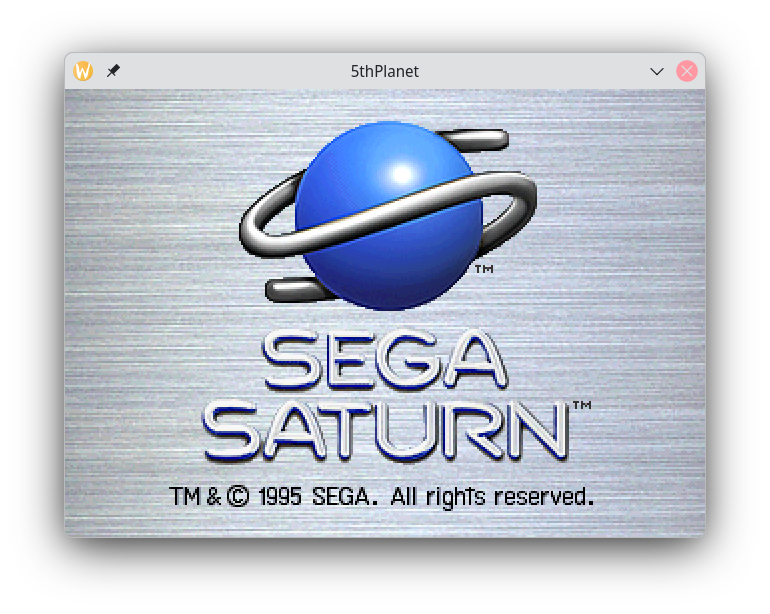
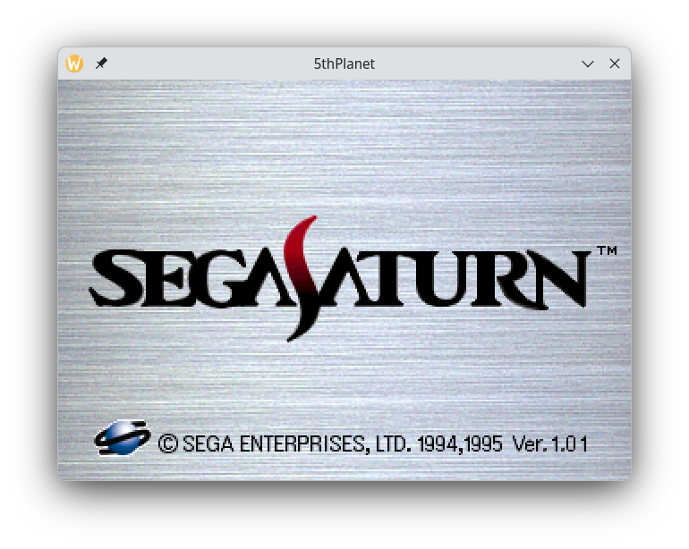

# 5thPlanet

An accuracy-first SEGA Saturn emulator in Rust.

The Saturn is one of the hardest 5th-gen consoles to emulate — eight
processors with tightly-coupled timing (2× SH-2 SH7604, MC68EC000,
VDP1, VDP2, SCU + SCU-DSP, SCSP M68k + SCSP-DSP, SH-1 CD-block) on a
shared bus. **Performance is explicitly subordinated to fidelity**:
this project will never include a JIT, dynarec, or any "approximate
cycle" shortcut. Each chip is built up one milestone at a time so the
foundation stays solid.

## Status

| Milestone | Goal                                                        | State        |
| --------- | ----------------------------------------------------------- | ------------ |
| M1        | Cycle-accurate SH-2 (SH7604) core                           | ✅ complete  |
| M2        | Saturn bus, dual SH-2, event-driven scheduler               | ✅ complete  |
| M3        | SCU, SMPC, VDP2 minimal, SCU-DSP, SDL2 window (scaffolding)  | ✅ complete  |
| M4        | BIOS splash on screen                                       | ✅ complete  |
| M5        | Chip-coverage build-out — VDP1, MC68EC000, full VDP2        | ✅ complete  |
| M6        | SCSP audio — slot/FM engine + SCSP-DSP                      | ✅ complete  |
| M7        | CD-block (HLE) + disc recognition + cartridge slot          | ✅ complete  |
| M8        | Save states + battery-backed backup RAM                     | ✅ complete  |
| M9        | Frontend OSD (in-window menu)                               | 🚧 active    |
| M10       | Live physical disc + CDDA→SCSP audio                        | ✅ complete  |
| M11       | Boot a game to gameplay (real-BIOS LLE, trace-diffed vs Mednafen) | 🚧 Doukyuusei ~if~ boots to its title screen (640×224 hi-res); the disc-present boot animation now plays (CD recognition spin-up); VF2 on a CD-state wall |

Current test count: **534 workspace-wide, 0 failures.** Task-by-task
status lives in [`doc/roadmap.md`](doc/roadmap.md).

A real BIOS now **boots to the SEGA Saturn splash**, rendered pixel-for-pixel
against the primary reference emulator (see [Acknowledgements](#acknowledgements)):
the bright brushed-metal "SEGA SATURN" logo, correct down to the VDP2 colour-RAM
banking and transparent-pen handling. All eight chips are modelled — the two
SH-2s, MC68EC000, VDP1 (full sprite/polygon plotter), VDP2 (multi-layer NBG/RBG
compositor with rotation), SCU + SCU-DSP, and SCSP (slot/FM audio + SCSP-DSP).
The **CD-block** is high-level-emulated (M7): it mounts a disc image (ISO /
CUE-BIN / CloneCD), reads the TOC, runs the buffer/filter/partition selector and
the sector read pump + data transfer, walks the ISO9660 filesystem, and
authenticates a Saturn disc — pass a game as the second argument. The
**cartridge slot** rounds out M7: Extension DRAM (1 MB / 4 MB), battery
backup-RAM, and game ROM carts plug into the rear expansion connector via
`--cart=` (the 4 MB DRAM cart is what Street Fighter Zero 3 / KOF '97 need).

**M8 adds save states**: `Saturn::save_state` / `load_state` snapshot the entire
deterministic machine state (both SH-2s, the 68k, every peripheral, all RAM, the
scheduler) to a versioned `bincode` blob — external media (BIOS, disc, ROM cart)
is referenced by fingerprint, not embedded. The SDL2 frontend binds **F5
quicksave / F9 quickload**. M8 also makes the **internal 32 KiB backup RAM** (the
console's built-in "memory card") hardware-faithful, with the odd-byte packing
real hardware uses, and persists it to a host `.bup` file so game saves survive a
restart like a battery-backed console.

**M10 adds CD-audio and live discs.** Games that stream Red Book CD-audio
tracks as BGM (e.g. Romance of the Three Kingdoms V) now play their music —
the CD-block decodes audio tracks and mixes them into the SCSP output. The
CD-block also reads sectors through a `SectorSource` trait, so besides ripped
images it can read an **original disc from a host optical drive**: build with
`--features physical-disc` and pass `cdrom:<device>` (e.g. `cdrom:/dev/sr0`).
That path uses **libcdio** and is the one place the workspace's
`unsafe_code = "forbid"` is relaxed, confined to the feature-gated
[`physdisc`](crates/physdisc) crate (see [ADR-0009](doc/adr/0009-physdisc-libcdio-ffi-crate.md)).

**M9 is building an in-window OSD menu** (ZSNES/fwNES-style, ADR-0008): press
**Esc** for a hand-rolled, software-composited menu — save/load state slots,
reset, eject/insert disc, quit — drawn with an embedded bitmap font over a
dimmed frame. The menu logic is `sdl2`-free and unit-tested. Graphics,
controller, region/BIOS, and cartridge submenus are the remaining M9 phases.

Real BIOS images booting in the SDL2 frontend, rendered pixel-for-pixel against
the MAME reference — each region's BIOS shows its own splash:

| USA BIOS | Japanese BIOS (v1.01) |
| --- | --- |
|  |  |

## Quick start

```bash
# Build & test everything
cargo test --workspace

# Format / lint
cargo fmt --all
cargo clippy --workspace --all-targets -- -D warnings

# Run a single test
cargo test -p sh2 -- decoder::tests::decodes_branches

# SDL2 frontend (default-on `sdl2-frontend` feature): opens a window and
# runs the supplied BIOS. Use --no-default-features for a headless run.
cargo run -p jupiter -- "bios/Sega Saturn BIOS (USA).bin"
```

## Controls

The SDL2 frontend maps the host keyboard to **port&nbsp;1** (a standard Saturn
digital control pad) plus a few emulator hotkeys. (Controller rebinding and
gamepad support are planned M9 phases.)

### Saturn control pad — port 1

| Saturn button | Keyboard |
| ------------- | -------- |
| D-pad ↑ ↓ ← → | Arrow keys |
| A / B / C     | Z / X / C |
| X / Y / Z     | A / S / D |
| L / R         | Q / W |
| Start         | Enter |

### Emulator hotkeys

| Action                            | Key |
| --------------------------------- | --- |
| Open / close the on-screen menu   | Esc |
| Quick save (to the quick slot)    | F5 |
| Quick load (from the quick slot)  | F9 |
| Quit                              | Close the window, or Esc → **Quit** |

### On-screen menu (while it is open)

| Action                              | Key |
| ----------------------------------- | --- |
| Move selection                      | ↑ / ↓ |
| Select                              | Enter or Z |
| Back (closes the menu at top level) | Backspace or X |
| Close menu                          | Esc |

## Workspace

- [`crates/sh2`](crates/sh2) — cycle-accurate SH-2 (SH7604) CPU core.
  `no_std` + `alloc`, no I/O.
- [`crates/m68k`](crates/m68k) — MC68EC000 core (the Saturn's SCSP sound
  CPU). `no_std` + `alloc`, library-shaped like `sh2`.
- [`crates/scu_dsp`](crates/scu_dsp) — SCU's embedded 32-bit DSP.
- [`crates/saturn`](crates/saturn) — Saturn system glue: memory map, dual
  SH-2 scheduler, SMPC, SCU + DMA + interrupt aggregator, VDP1 (full
  sprite/polygon plotter), VDP2 (multi-layer NBG/RBG compositor with
  rotation + live raster timing), SCSP (slot/FM audio engine + hosted
  MC68EC000 + SCSP-DSP), the CD-block (HLE: disc image + TOC,
  buffer/filter/partition, read pump + transfer, ISO9660 FS, authentication),
  and the cartridge slot (Extension DRAM / backup-RAM / ROM carts).
- [`crates/physdisc`](crates/physdisc) — live optical-drive `SectorSource`
  via libcdio, feature-gated (`libcdio`); the only crate that uses `unsafe`
  (FFI). Default build is a stub.
- [`crates/debugger`](crates/debugger) — interactive headless Saturn debugger
  (bin `sdbg`): a gdb-style REPL over the core with breakpoints (incl.
  register-guarded), single-step, SH-2 **and** SCSP-68k disassembly + PC-trace,
  read/write watchpoints, memory search, CD-block + SCSP/68k state, command
  history, and save-state rewind. `cargo run -p sdbg -- <bios.bin> [disc.cue]`.
- [`jupiter`](jupiter) — SDL2 frontend binary (window +
  framebuffer upload + audio, or headless), behind a default-on feature.
  Includes the hand-rolled in-window OSD menu (`src/osd/`, Esc to open).
  `cargo run -p jupiter -- <bios.bin> [disc.cue]`. (The binary is named
  `jupiter` for Jupiter — the 5th planet, hence the project name
  *5thPlanet* — the neighbour of Saturn: closest to it, but not identical.)

## BIOS

SEGA Saturn BIOS images go in `bios/` and are **never committed** —
they're copyrighted by SEGA and each developer supplies their own
legally-obtained dump. See [`bios/README.md`](bios/README.md) for the
expected filenames and rationale.

## Contributing

The repository ships with project-tailored Claude Code skills under
[`.claude/skills/`](.claude/skills) (`code-review`,
`commit-and-push`, `docs-engineering`, `release-engineering`,
`security-audit`). [`CLAUDE.md`](CLAUDE.md) documents the architecture
in depth and the conventions a contributor needs to follow. The
Saturn-specific vocabulary used throughout the codebase and commits
is collected in [`doc/glossary.md`](doc/glossary.md), and significant
design decisions and their rationale are recorded as Architecture
Decision Records in [`doc/adr/`](doc/adr/). For how the Saturn hardware
maps onto this project's crates and modules, see
[`doc/system-architecture.md`](doc/system-architecture.md).

## Acknowledgements

Several open-source emulators are leaned on as **reference oracles for
verifying system architecture** — run headless against the same BIOS so
their master SH-2 instruction traces can be diffed against ours,
confirming the SH-2 core, cache, SMPC, SCU, and bus reproduce known-good
behavior and pinpointing boot-sequence bugs down to the exact
instruction:

- [Mednafen](https://mednafen.github.io/) (Beetle Saturn) — the
  **accuracy reference for game-level behavior**. Its Saturn module has
  the highest game compatibility of the open-source emulators (it runs
  the commercial library, including the dual-SH-2 / SCU-DSP / VDP1 3D
  titles), so it is the oracle for the game-boot work (M11): a local
  instrumented build emits VF2's master-SH-2 trace and CD command/HIRQ
  stream to diff against ours (both running the real BIOS). That diff
  pinned the M11 root — a spurious `DCHG` (Disc Changed) our CD-block
  re-raised at `Init`, which made the BIOS loop recognition — and with it
  fixed, VF2 and Doukyuusei ~if~ now load their 1st-read program and run their
  own game code. **Doukyuusei ~if~ boots all the way to its title screen**
  (rendered at its native 640×224 hi-res): its intro slave crash was a SH7604
  FRT `FTCSR` write-0-to-clear bug (the inter-CPU FRT input-capture handshake),
  and VDP2 hi-res rendering then displayed it without overflow. VF2 still loops
  in its intro on a polled-CD-state divergence — the remaining game-boot
  blocker — with the CD-HIRQ axis now exhausted for it.
- [MAME](https://github.com/mamedev/mame) — the **low-level / early-boot**
  reference. Its Saturn driver models the chips closely (down to a
  low-level CD-block SH-1) and is the authority for CPU/bus/peripheral
  behavior, but its *game* compatibility is limited, so it's used for the
  early boot and subsystem logic rather than full game runs — e.g. it
  showed a stuck boot was a wrong-path symptom, then that a periodic
  report was clobbering the CD-block signature the BIOS checks.
- [Yabause](https://github.com/Yabause/yabause) — the **secondary**
  reference; the primary during early development (M1–M3) and still a
  useful second opinion (its `src/bios.c` was the blueprint for a
  since-removed HLE BIOS experiment). A patched, headless build emits the
  master PC stream for diffing.

Each is set up as a local, **never-committed** build (gitignored
`mednaref/`, `mameref/`, `yabref/`). **No emulator code is included in or
derived by this project** — they serve purely as behavioral references for
cross-checking; each is GPL-licensed and remains entirely separate from
5thPlanet's MIT-licensed source.

## Trademarks & copyrights

5thPlanet is an independent, unofficial project and is **not affiliated with,
endorsed by, or sponsored by SEGA**. "SEGA", "Sega Saturn", and the Sega Saturn
logos are trademarks of their respective owners (SEGA Corporation and/or its
affiliates). They are referenced here only for identification and
interoperability — to describe the hardware this emulator targets.

The Sega Saturn BIOS, games, and any disc images are **copyrighted by their
respective owners and are not distributed with this project** (see
[BIOS](#bios)); supply your own legally-obtained copies. The screenshots in
[`doc/screenshots/`](doc/screenshots) show SEGA's copyrighted boot logos and are
included solely to document the emulator's output.

No SEGA code, firmware, or assets are included in or derived by this project; it
is a clean-room behavioral re-implementation cross-checked against the
[reference emulators](#acknowledgements). Only the original source in this
repository is covered by the licence below.

## License

MIT — see [`LICENSE`](LICENSE). This licence applies to 5thPlanet's own source
code only, not to any third-party trademarks or copyrighted material referenced
above.
